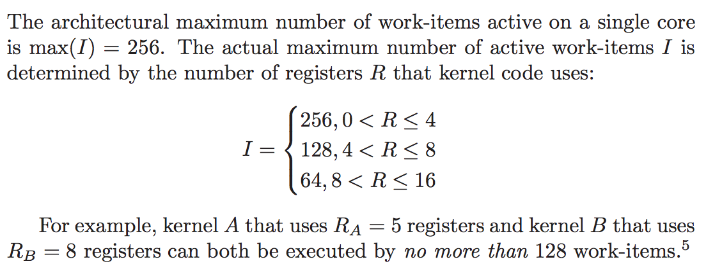

# Optimizing GEneral Matrix-to-Matrix Multiplication (GEMM) Performance on Android

## Test Device

We tested on `Samsung Galaxy S6`, which has a `Mali-T760` GPU.

```
Platform: ARM Platform
  Device: Mali-T760
    OpenCL Driver version  : 1.1 (Android)
    Compute units   : 8
    Clock frequency : 772 MHz
    workgroup sizes : 256
```

The current configuration is set to link with [libOpenCL.so](opencl/libOpenCL.so) from this device. 

To run a test, use 

```
./intelgemm --kernel tn -s [matrix_size] --global-size [global_work_size] --local-size [local_work_size]  --validation
```


## Peak

The peak floating-point computation performance is benchmarked through [https://github.com/krrishnarraj/clpeak](https://github.com/krrishnarraj/clpeak).

```
Platform: ARM Platform
  Device: Mali-T760
    Driver version  : 1.1 (Android)
    Compute units   : 8
    Clock frequency : 772 MHz
    workgroups per compute unit : 2048
    workgroup sizes : 256
    max alloc size : 536870912

    Global memory bandwidth (GBPS)
      float   : 6.05
      float2  : 10.51
      float4  : 12.15
      float8  : 12.17
      float16 : 10.68

    Single-precision compute (GFLOPS)
globalWIs = 4194304
      float   : 12.32
      float2  : 32.25
      float4  : 31.79
      float8  : 45.37
      float16 : 154.02

    Double-precision compute (GFLOPS)
      double   : 3.04
      double2  : 30.11
      double4  : 22.09
      double8  : 35.68
      double16 : 34.79

    Integer compute (GIOPS)
      int   : 5.13
      int2  : 12.43
      int4  : 11.99
      int8  : 15.83
      int16 : 72.55

    Transfer bandwidth (GBPS)
      enqueueWriteBuffer         : 4.69
      enqueueReadBuffer          : 4.08
      enqueueMapBuffer(for read) : 2536.00
        memcpy from mapped ptr   : 4.36
      enqueueUnmap(after write)  : 2382.92
        memcpy to mapped ptr     : 4.41

    Kernel launch latency : 1399.80 us
   
```

## Constraints

One important thing to notice is the following constraints [1].



## Performance

### Main Results
| Size        | CL Kernel           | Throughput (GFlops) |
| ------------- |:-------------:| -----:|
| 1024 x 1024   | [noblock-v8](gemm-noblock-vload8.cl) | 11.14 |
| 1024 x 1024 | [blocking-2x2-v4](gemm-blocking-2x2-vload4.cl)  |  17.4 
| 2048 x 2048     | [noblock-v8](gemm-noblock-vload8.cl)      |  15.45 |
| 2048 x 2048 | [blocking-2x2-v4](gemm-blocking-2x2-vload4.cl)     |  27.3 |
| 4096 x 4096 | [noblock-v8](gemm-noblock-vload8.cl)  |   15.6  |
| 4096 x 4096 | [blocking-2x2-v4](gemm-blocking-2x2-vload4.cl)  |  4.4  |

### Other Results

| Size        | CL Kernel           | Throughput (GFlops) |
| ------------- |:-------------:| -----:|
| 1024 x 1024 | [noblock-v16](gemm-noblock-vload16.cl) | 6.46 |
| 1024 x 1024 | [noblock-v16-dotprod](gemm-noblock-vload16.cl) | 11.50 |
| 2048 x 2048 | [noblock-v16](gemm-noblock-vload16.cl) | 6.09 |
| 2048 x 2048 | [noblock-v16-dotprod](gemm-noblock-vload16.cl) | 15.10 |
| 2048 x 2048 | [blocking-4x4-v8](gemm-blocking-4x4-vload8.cl) | 17.2 |
| 2048 x 2048 | [blocking-4x4-v4](gemm-blocking-4x4-vload4.cl) | 10.6 |


# GEMM Zoo

Available implementations in literature for reference. None of these achieve good performance on our Android test device.

* [Some GEMM implementation in clBLAS] (https://github.com/clMathLibraries/clBLAS/blob/master/src/library/blas/gens/clTemplates/sgemm_gcn_SmallMatrices.cl)
* [NVidia Implementation Sample] (http://www.nvidia.com/content/cudazone/CUDABrowser/downloads/papers/NVIDIA_OpenCL_BestPracticesGuide.pdf)
* [Intel GEMM Sample] (https://software.intel.com/sites/products/vcsource/files/GEMM.pdf)
* [ViennalCL] (https://www.researchgate.net/publication/229430755_ViennaCL_-_A_High_Level_Linear_Algebra_Library_for_GPUs_and_Multi-Core_CPUs)

# Useful Links

1. [Optimizing OpenCL Kernels for Mali-T600 GPUs](http://malideveloper.arm.com/downloads/GPU_Pro_5/GronqvistLokhmotov_white_paper.pdf)

